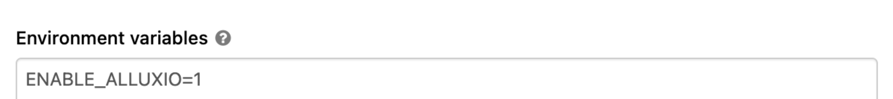

# RAPIDS Accelerator for Apache Spark Docker container for Databricks

## Build the container

You will need to build the Docker container before using it in the Databricks environment. This can be done with the provided build script. You can customize a few options using environment variables, but will at minimum need to set REPO_BASE and TAG_NAME to a repository where you can push the built image. For example to push an image to repository at `i-love-spark/rapids-4-spark-databricks`:

```bash
$ REPO_BASE=i-love-spark TAG_NAME=rapids-4-spark-databricks ./build.sh
```

The script will then build an image with fully qualified tag: `i-love-spark/rapids-4-spark-databricks:23.02.0`. 

If you set `PUSH=true`, if the build completes successfully, the script will push it to specified repository. Only do this if you have authenticated using Docker to the repository and you have the appropriate permissions to push image artifacts.

```bash
$ REPO_BASE=i-love-spark TAG_NAME=rapids-4-spark-databricks PUSH=true ./build.sh
```

There are other customizations possible, below are all the environment variables that can be customized
when running `build.sh`.

Standard environment variables: 

* `REPO_BASE`: 
* `TAG_NAME`: These 2 parameters (along with `VERSION`) form the fully qualified image tag for the built Docker image. For example, if you set `REPO_BASE=i-love-spark`, `TAG_NAME=rapids-4-spark-databricks`, and `VERSION=23.02.0`, the image you build will have the fully qualifed tag `i-love-spark/rapids-4-spark-databricks:23.02.0`.
* `VERSION`: This parameter configures both the tag of the Docker image and the version of the rapids-4-spark Jar file that is pulled from Maven Central when building the Docker container image. The default value of this variable is `23.02.0`.
* `TAG_VERSION`: Use this parameter to override the image tag version (e.g. specify `TAG_VERSION=foo` and the fully qualfied tag will be `i-love-spark/rapids-4-spark-databricks:foo` even though it will have the 23.02.0 jar file). This defaults to the value of `VERSION`.

Advanced parameters. Use these parameters at your own risk:
* `CUDA_VERSION`: Specify the version of CUDA to be used. The default value is `11.8.0`.
* `JAR_VERSION`: Specify a different version of the JAR file to pull from maven central outside of the `VERSION` parameter. Use this in conjunction with `TAG_VERSION` to customize the JAR file within the Docker container image. This defaults to the value of `VERSION`.
* `BASE_JAR_URL`: Specifies the Maven repository base to pull the JAR file from. This defaults to `https://repo1.maven.org/maven2/com/nvidia/rapids-4-spark_2.12`. Use this if you want to pull the JAR file from a different Maven repository.
* `JAR_FILE`: Specifies the JAR file to download and/or filename that will be used on the container file system. This defaults to `rapids-4-spark_2.12-23.02.0-cuda11.jar`, which is the CUDA 11 qualified JAR with version `23.02.0`. When not specified directly, it will automatically update based on `VERSION` and `CUDA_VERSION` values.
* `JAR_URL`: Use this to download directly a specific JAR file to be copied into the Docker container image. This defaults to a combination of `BASE_JAR_URL` and `JAR_FILE`. This is sometimes needed when the JAR file is not hosted in a Maven repository just yet. You can also specify a local file on your Docker host, which is
useful for including a customized built JAR file.


Once this image is pushed to your repository, it is ready to be used in the Databricks environment.

## Usage

The easiest way to use the RAPIDS Accelerator for Spark on Databricks is use the pre-built Docker
container and Databricks Container Services.

Currently the Docker container supports the following Databricks runtime(s) via Databricks Container Services:
- [Databricks 10.4 LTS](https://docs.databricks.com/release-notes/runtime/10.4.html#system-environment)
- [Databricks 11.3 LTS](https://docs.databricks.com/release-notes/runtime/11.3.html#system-environment)

See [Customize containers with Databricks Container Services](https://docs.databricks.com/clusters/custom-containers.html) for more information.

Create a Databricks cluster by going to Clusters, then clicking `+ Create Cluster`.  Ensure the
cluster meets the prerequisites above by configuring it as follows:

1. In the `Databricks runtime version` field, click `Standard` and select `Runtime: 10.4 LTS (Scala 2.12, Spark 3.2.1)` (do NOT use `Runtime: 10.4 LTS ML (GPU, Scala 2.12, Spark 3.2.1)` from the `ML` tab).

2. Ensure `Use Photon Acceleration` is disabled.

Note that GPU nodes are not available to be selected at this time for the driver or the workers. Therefore, you will first configure the use of the Docker container before configuring the driver and worker nodes.

3. Under the `Advanced options`, select the `Docker` tab.


4. Select `Use your own Docker container`.

5. In the `Docker Image URL` field, enter the image location you pushed to using the build steps.

6. Set `Authentication` set to `Default` if using a public repository, or configure `Authentication` for the repository you have pushed the image to.

Now you can configure the driver and worker nodes in the main part of the UI.

7. Choose the number of workers that matches the number of GPUs you want to use.

8. Select a worker type.  On AWS, use nodes with 1 GPU each such as `p3.2xlarge` or `g4dn.xlarge`.
   p2 nodes do not meet the architecture requirements (Pascal or higher) for the Spark worker
   (although they can be used for the driver node).  For Azure, choose GPU nodes such as
   Standard_NC6s_v3.  For GCP, choose N1 or A2 instance types with GPUs. 


9. Select a driver type. Generally, this can be set the same as the worker, but you can select a node that 
   does NOT include a GPU if you don't plan to do any GPU-related operations on the driver. On AWS, this 
   can be an `i3.xlarge` or larger.


10. Ensure `Enable autoscaling` is disabled.

11. Now under `Advanced options`, select the `Init Scripts` tab.

12. In the `Destination` field, select `FILE`.

13. In the `Init script path` field, enter `file:/opt/spark-rapids/init.sh`

14. Click `Add`.

15. Add any other configs, such as SSH Key, Logging, or additional Spark configuration. The Docker container uses the configuration in `00-custom-spark-driver-defaults.conf` by default. When adding additional lines to `Spark config` in the UI, the configuration will override those defaults that are configured in the Docker container.

16. Start the cluster.

### Enabling Alluxio in the Databricks cluster using the Docker container

If you would like to enable the Alluxio cluster on your Databricks cluster, you will need to add the following configuration to your cluster.

1. Edit the desired cluster.

2. Under the `Advanced options`, select the `Spark` tab.

3. In the `Spark config` field, add the following lines. The second 2 are good starting points when using Alluxio but could be tuned
if needed.

```
spark.databricks.io.cached.enabled false
spark.rapids.alluxio.automount.enabled true
spark.rapids.sql.coalescing.reader.numFilterParallel 2
spark.rapids.sql.multiThreadedRead.numThreads 40
```

4. In the `Environment variables` field, add the following lines:   
    `ENABLE_ALLUXIO=1`   
    `ALLUXIO_HOME=/opt/alluxio-2.9.0`   


5. Customize Alluxio configuration using the following configs if needed. These should be added in the `Environment variables` field if you wish to change them.

  - The default amount of disk space used for Alluxio on the Workers is 70%.  This can be adjusted using the configuration below. `ALLUXIO_STORAGE_PERCENT=70`

  - The default heap size used by the Alluxio Master process is 16GB, this may need to be changed depending on the size of the driver node. Make sure it has enough memory for the Master and the Spark driver processes.  `ALLUXIO_MASTER_HEAP=16g`

  - To copy the Alluxio Master and Worker logs off of local disk to be able to look at them after the cluster is shutdown you can configure this to some path accessible via rsync.  For instance, on Databricks this might be a path in /dbfs/.  `ALLUXIO_COPY_LOG_PATH=/dbfs/somedirectory-for-alluxio-logs/`

  - To copy the Alluxio metrics which are in Prometheus format to be able to look at them after the cluster is shutdown you can configure this to some path accessible via rsync. For instance, on Databricks this might be a path in /dbfs/.  `PROMETHEUS_COPY_DATA_PATH=/dbfs/somedirectory-for-alluxio-prometheus-metrics/`. The saved Prometheus data can be graphed outside of the cluster. For more details, refer to `spark-rapids/docs/get-started/getting-started-alluxio.md` in [spark-rapids doc](https://github.com/NVIDIA/spark-rapids)

6. Click `Confirm` (if the cluster is currently stopped) or `Confirm and Restart` if the cluster is currently running.

7. Ensure the cluster is started by click `Start` if necessary.

To verify the alluxio cluster is working, you can use the Web Terminal:

1. Ensure the cluster is fully up and running. Then in the cluster UI, click the `Apps` tab.

2. Click `Launch Web Terminal`.

3. In the new tab that opens, you will get a terminal session.

4. Run the following command:

```bash
$ /opt/alluxio-2.8.0/bin/alluxio fsadmin report
```

5. You should see a line indicating the number of active workers, ensure this is equal to the configured number of workers you used for the cluster:

```
...
     Live Workers: 2
...
```
