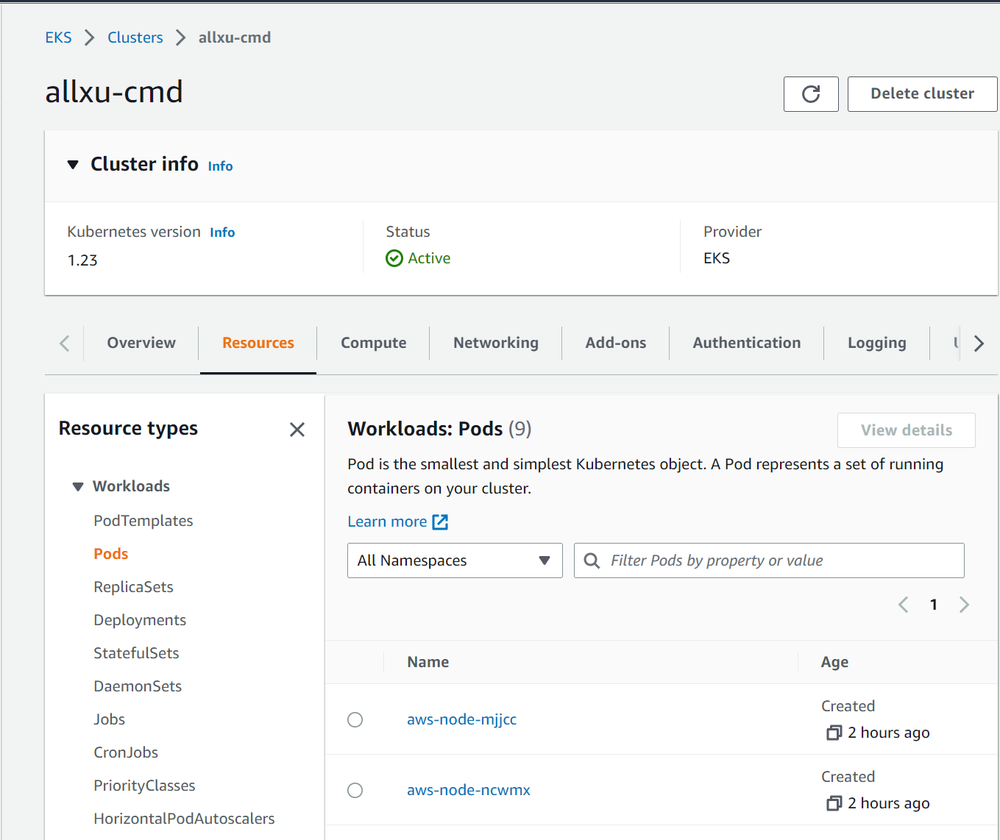
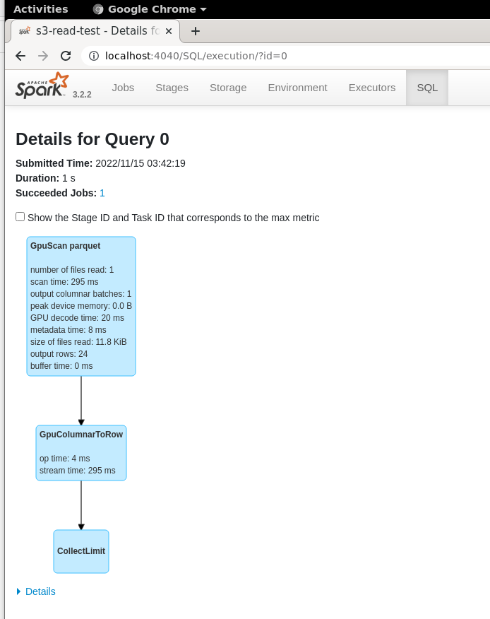

# RAPIDS Accelerator for Apache Spark Docker container for Kubernetes

## Build the container

You will need to build the Docker container before using it in the Kubernetes(k8s) environment.
Different from the official Spark docker image, this Dockerfile doesn't require a Spark distribution
pre-downloaded which contains the official [docker image tool]((https://spark.apache.org/docs/latest/running-on-kubernetes.html#docker-images))
in your local machine. It will download Spark distribution inside the Dockerfile. Also, spark-rapids
plugin jar is downloaded into the `SPARK_HOME/jars` directory which means user doesn't need to specify
extra `--jars` option when submitting Spark applications.

command to build the container:

```bash
docker build -t <repo>:<tag> -f Dockerfile .
```
NOTE: Before pushing the docker image to a public repository, please make sure you have configured
your Docker properly. For more information, please refer to [Docker documentation](https://docs.docker.com/engine/reference/commandline/login/).

## Push the image to a Docker registry

command to push the image:
```bash
docker push <repo>:<tag>
```

## Usage

## AWS EKS
Prerequisites: 
1. [Installing kubectl](https://docs.aws.amazon.com/eks/latest/userguide/install-kubectl.html)
2. [Installing eksctl](https://docs.aws.amazon.com/eks/latest/userguide/eksctl.html)
3. Basic understanding of [AWS EKS](https://docs.aws.amazon.com/eks/latest/userguide/what-is-eks.html)
   and its permission system [AWS IAM](https://docs.aws.amazon.com/IAM/latest/UserGuide/introduction.html)

## Create an EKS cluster with a GPU node group
Before executing the following command, please make sure you have configured your AWS CLI properly.
Please make sure you have configured your local AWS identity(user) the same as the one you are using
to browse the AWS console.

To check the identity:
1. launch the AWS CloudShell then type `aws sts get-caller-identity`.
2. launch you local terminal then type `aws sts get-caller-identity`.

Make sure the output of the two commands are the same. Otherwise, you will not be able to see your 
cluster information in the AWS console.

A recommanded way to manage your EKS cluster is to create a dedicated user in your AWS account, For
more information please refer to [AWS IAM](https://docs.aws.amazon.com/IAM/latest/UserGuide/introduction.html).

```bash

To create an EKS cluster with a GPU node group:
```bash
eksctl create cluster \
--name test-cluster \
--region us-west-2 \
--with-oidc \
--ssh-access \
--ssh-public-key <user-key-pair> \
--managed \
--nodegroup-name gpu-node-group \
--node-type g4dn.xlarge \
--nodes 2 \
--nodes-min 0 \
--nodes-max 4 \
--vpc-public-subnets <subnets-with-comma-separated>
```

Then you can see your cluster in the AWS console:


### Submit Spark applications to the EKS cluster
1. get cluster master IP address
   ```bash
   $ kubectl cluster-info
   Kubernetes control plane is running at https://8440EE5F8730EDD7D8B989F704DE1DFE.gr7.us-west-2.eks.amazonaws.com
   CoreDNS is running at https://8440EE5F8730EDD7D8B989F704DE1DFE.gr7.us-west-2.eks.amazonaws.com/api/v1/namespaces/kube-system/services/kube-dns:dns/proxy
   ```
   The master IP address is `https://8440EE5F8730EDD7D8B989F704DE1DFE.gr7.us-west-2.eks.amazonaws.com`, it    will be the k8s master address when submitting Spark applications.

2. create ServiceAccount and ClusterRoleBinding for the Spark application
   ```bash
   # service account named spark
   kubectl create serviceaccount spark
   # cluster role binding for the service account
   kubectl create clusterrolebinding spark-role --clusterrole=edit --serviceaccount=default:spark    --namespace=default
   ```

3. submit Spark applications

   This Spark application will read data from a public s3 bucket then show them in the console.
   There is a short sleep period(300 seconds) in the application to simulate a long running Spark application.
   User can get access to the Spark UI during this period.
   User needs to set IMAGE_NAME, K8SMASTER and their aws access key and secret key accordingly in the command.
   
   ```bash
   # use Spark-3.2.2 as example, it can be modified when building the docker image
   export SPARK_HOME=<path to>/spark-3.2.2-bin-hadoop3.2
   # set your docker image path
   export IMAGE_NAME=<repo>:<tag>
   # set k8s master address
   export K8SMASTER=k8s://8440EE5F8730EDD7D8B989F704DE1DFE.gr7.us-west-2.eks.amazonaws.com:443
   # use defualt namespace as an example
   export SPARK_NAMESPACE=default
   export SPARK_DRIVER_NAME=example-driver
   
   $SPARK_HOME/bin/spark-submit \
        --master $K8SMASTER \
        --deploy-mode cluster  \
        --name example-app \
        --driver-memory 2G \
        --conf spark.eventLog.enabled=false \
        --conf spark.executor.cores=1 \
        --conf spark.executor.instances=1 \
        --conf spark.executor.memory=4G \
        --conf spark.executor.resource.gpu.amount=1 \
        --conf spark.executor.resource.gpu.discoveryScript=/opt/spark/examples/src/main/scripts/getGpusResources.sh \
        --conf spark.executor.resource.gpu.vendor=nvidia.com \
        --conf spark.hadoop.fs.s3a.access.key=<your aws access key> \
        --conf spark.hadoop.fs.s3a.secret.key=<your aws secret key> \
        --conf spark.hadoop.fs.s3a.fast.upload=true \
        --conf spark.hadoop.fs.s3a.impl=org.apache.hadoop.fs.s3a.S3AFileSystem \
        --conf spark.kubernetes.authenticate.driver.serviceAccountName=spark \
        --conf spark.kubernetes.container.image.pullPolicy=Always \
        --conf spark.kubernetes.container.image=$IMAGE_NAME \
        --conf spark.kubernetes.driver.pod.name=$SPARK_DRIVER_NAME \
        --conf spark.kubernetes.file.upload.path=s3a://<s3 bucket to staging your jar or python script> \
        --conf spark.kubernetes.namespace=$SPARK_NAMESPACE \
        --conf spark.plugins=com.nvidia.spark.SQLPlugin \
        --conf spark.rapids.memory.pinnedPool.size=2G \
        --conf spark.task.resource.gpu.amount=1 \
        file:///$PWD/read-s3-test.py
   ```

   After execution, check the logs of the driver pod:
   ```bash
   $ kubectl logs example-driver
   ...
   22/11/14 10:53:45 WARN RapidsPluginUtils: RAPIDS Accelerator 22.10.0 using cudf 22.10.0.
   ...
   22/11/14 10:54:03 WARN GpuOverrides:
   ...
   +-----------------+
   |cc_call_center_id|
   +-----------------+
   | AAAAAAAABAAAAAAA|
   | AAAAAAAACAAAAAAA|
   | AAAAAAAACAAAAAAA|
   | AAAAAAAAEAAAAAAA|
   | AAAAAAAAEAAAAAAA|
   | AAAAAAAAEAAAAAAA|
   | AAAAAAAAHAAAAAAA|
   | AAAAAAAAIAAAAAAA|
   | AAAAAAAAIAAAAAAA|
   | AAAAAAAAKAAAAAAA|
   | AAAAAAAAKAAAAAAA|
   | AAAAAAAAKAAAAAAA|
   | AAAAAAAANAAAAAAA|
   | AAAAAAAAOAAAAAAA|
   | AAAAAAAAOAAAAAAA|
   | AAAAAAAAABAAAAAA|
   | AAAAAAAAABAAAAAA|
   | AAAAAAAAABAAAAAA|
   | AAAAAAAADBAAAAAA|
   | AAAAAAAAEBAAAAAA|
   +-----------------+
   only showing top 20 rows
   ```
4. Delete the pod
   ```bash
   kubeclt delete pod example-driver
   ```

### Access Spark UI
Before deleting the pod, you can access the Spark UI by port-forwarding the driver pod:
```bash
$ kubectl port-forward example-driver 4040:4040
Forwarding from 127.0.0.1:4040 -> 4040
Forwarding from [::1]:4040 -> 4040
...
```
Then you can access the Spark UI at http://localhost:4040.

