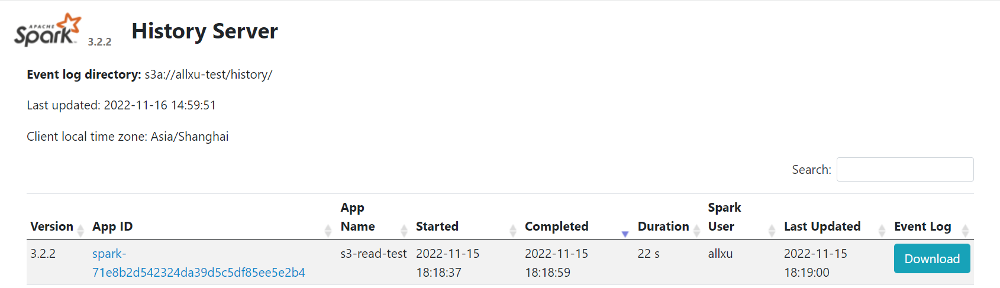

# Spark History Server for Kubernetes

This repository also provides the accessibility to Spark History Server(SHS) for Kubernetes(k8s).
The SHS is a web UI that allows you to view information about completed Spark applications.
It is a separate service from the Spark application.

The SHS service is deployed by [Helm Charts](https://helm.sh/docs/topics/charts/) with the ability for
public access without manually port-forwarding. For more information, please refer to [SHS Chart](https://github.com/helm/charts/tree/master/stable/spark-history-server)

## Prerequisites
1. [Helm](https://helm.sh/docs/intro/install/)
2. A running EKS cluster


## Prepare the Docker image

The Docker image can be built by running the following command:

```bash
docker build -t <repo>:<tag> -f Dockerfile .
```

Then push to your Docker registry:

```bash
docker push <repo>:<tag>
```

## Prepare your AWS credentials
1. save your AWS ACCESS KEY to file `aws-access-key`
2. save your AWS SECRET KEY to file `aws-secret-key`
3. generate `aws-secrets` for k8s by running the following command:
```bash
kubectl create secret generic aws-secrets --from-file=aws-access-key --from-file=aws-secret-key
```

## Add Helm repository
```bash
helm repo add stable https://charts.helm.sh/stable
```

## Config SHS yaml file
User should minimally configure the SHS yaml file by modifying the following parameters:
1. `s3.logDirectory`: the S3 bucket path where the Spark application logs are stored
2. `image.repository` & `image.tag`: the Docker image repository and tag
More configurable parameters can be found in [SHS Chart Configurations](https://github.com/helm/charts/tree/master/stable/spark-history-server#configurations)

## Install Helm SHS Chart

```bash
helm install stable/spark-history-server --namespace default -f shs_s3.yaml --generate-name
```

Check SHS service status by running the following command:
```bash
$ kubectl get svc
NAME                              TYPE           CLUSTER-IP      EXTERNAL-IP                                                              PORT(S)           AGE
kubernetes                        ClusterIP      10.100.0.1      <none>                                                                   443/TCP           3h17m
spark-history-server-1668577003   LoadBalancer   10.100.26.191   a461246ba4b634bcda15c494946b97f1-688240214.us-west-2.elb.amazonaws.com   18080:31714/TCP   81m

```
The EXTERNAL-IP is the public IP address of the SHS service.

## Access SHS UI
Open the `EXTERNAL-IP:18080` in a browser, you should be able to see the SHS UI.

